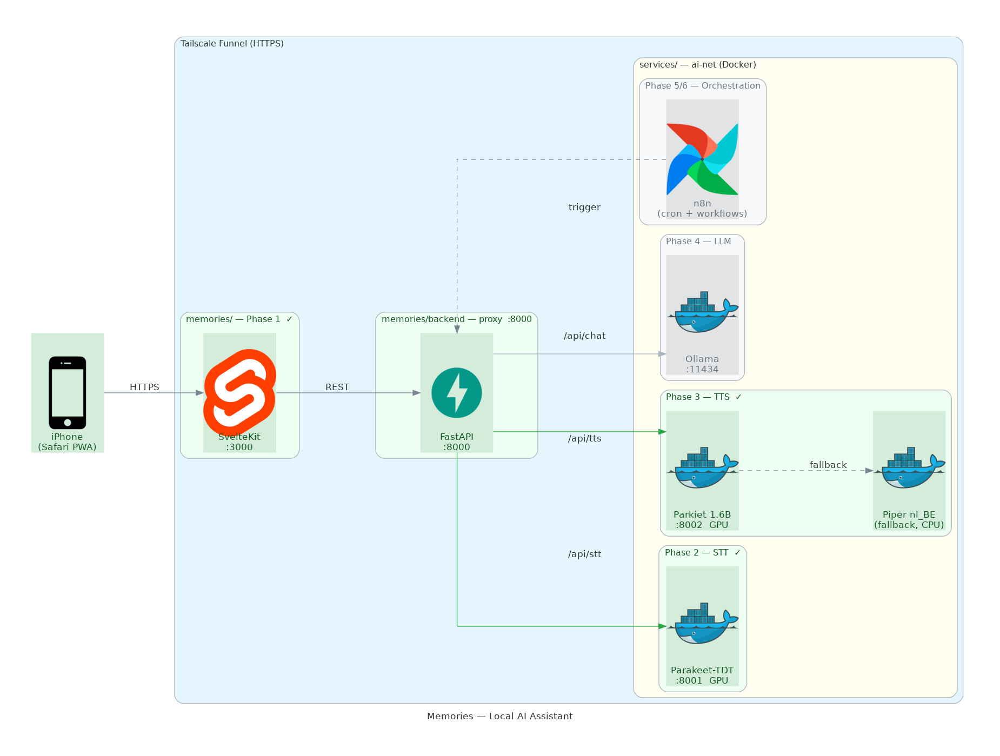

# Memories

Personal AI assistant that runs entirely local on a home server (RTX 3060 Ti). Dutch-language voice interface accessible as PWA via iPhone.

## Architecture



> Generate: `pip install diagrams && sudo apt install graphviz && python docs/generate_architecture.py`

## Stack

| Layer         | Technology                                    |
|---------------|-----------------------------------------------|
| Frontend      | SvelteKit PWA                                 |
| Backend       | FastAPI (Python 3.11)                         |
| STT           | NVIDIA Parakeet-TDT-0.6B (onnx-asr + ONNX Runtime GPU) |
| TTS           | Parkiet 1.6B (primary), Piper nl_BE (fallback)|
| LLM           | Ollama (model TBD)                            |
| Orchestration | n8n                                           |
| Infra         | Docker, nvidia-container-toolkit, WSL2        |
| Access        | Tailscale Funnel (HTTPS, no port forwarding)  |

## API Endpoints

| Method | Path                    | Description                       | Status |
|--------|-------------------------|-----------------------------------|--------|
| POST   | `/api/stt`              | Audio → text (Dutch, Parakeet)    | Done   |
| POST   | `/api/tts/synthesize`   | Text → WAV audio (Piper/Parkiet)  | Done   |
| GET    | `/api/tts/engines`      | List available TTS engines        | Done   |
| POST   | `/api/chat`             | LLM conversation                  | Phase 4|

## Quick Start

```bash
# Start all services
docker compose up

# Dev mode
cd frontend && npm run dev -- --host    # :3000
cd backend && uvicorn app.main:app --reload  # :8000
```

## Roadmap

- [x] Phase 1 — PWA basis
- [x] Phase 2 — STT (Parakeet)
- [x] Phase 3 — TTS (Parkiet + Piper fallback)
- [ ] Phase 4 — LLM (Ollama)
- [ ] Phase 5 — News briefing (cron 04:30)
- [ ] Phase 6 — Calendar (Outlook)
- [ ] Phase 7 — Hardening
